# 18237026 윤정민

## 2주차 과제

</img>

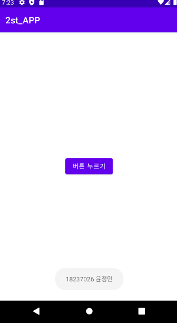</img>

## 3주차 과제

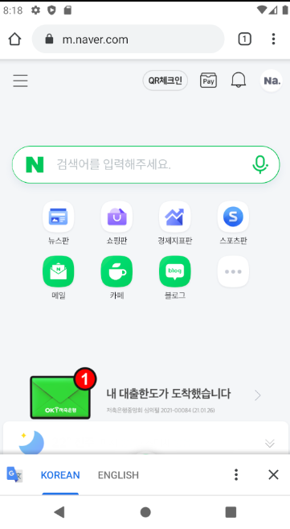</img>

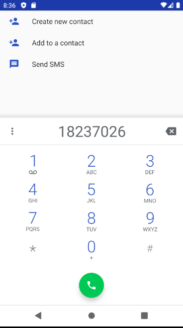</img>

## 4주차 과제 
 
- 정기구독결제 관리해주는
 기존 은행 어플에 추가하고 싶은 서비스
 
 이벤트성으로 구독을 해놨거나 사용을 하려고 정기적으로 구독 결제를 해놓은 어플이나 서비스 리스트를 정리해놓고 
 사용 횟수 빠져나간 금액 다음 달 결제일등 표시해 놓고 알림을 줘서 
 해지하는 걸 잊은 사용자가 자신도 모르게 빠져나가는 지출을 방지할 수 있음
 
## 5주차 과제 

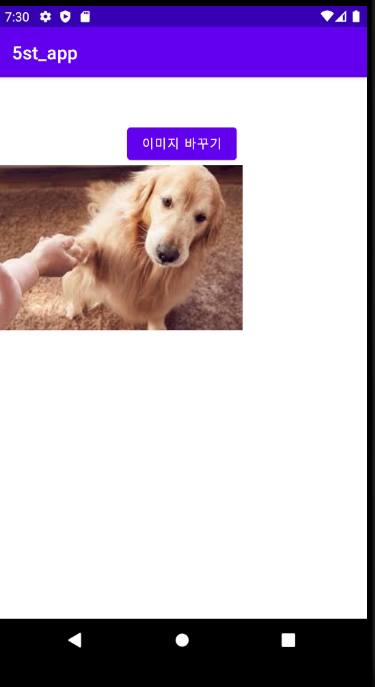</img>

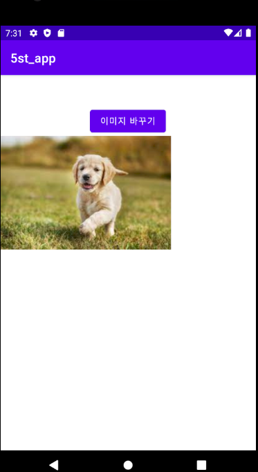</img>

## 6주차 과제 

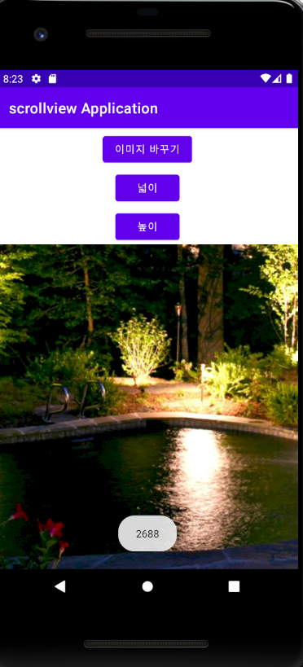</img>

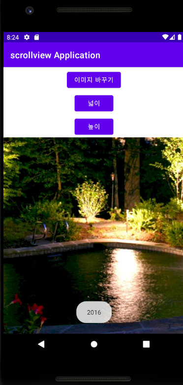</img>

## 7주차 과제

</img>

## 9주차 과제 

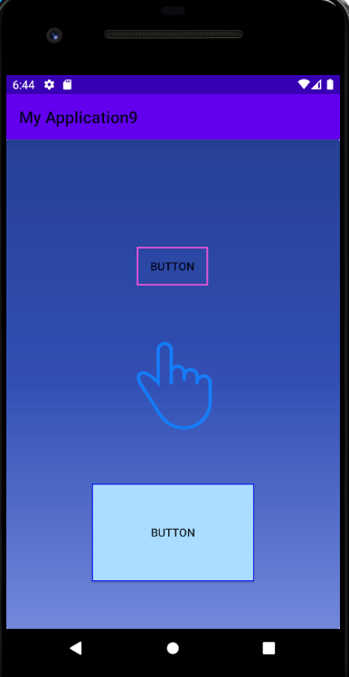</img>

## 10주차 과제 

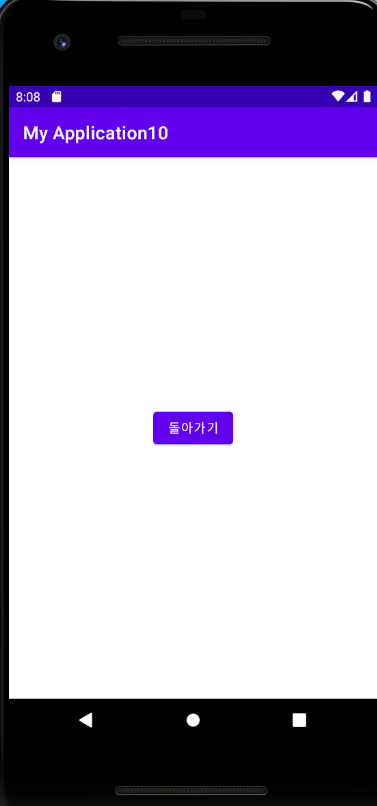</img>
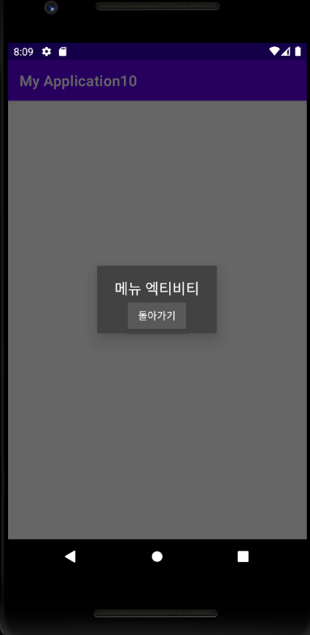</img>
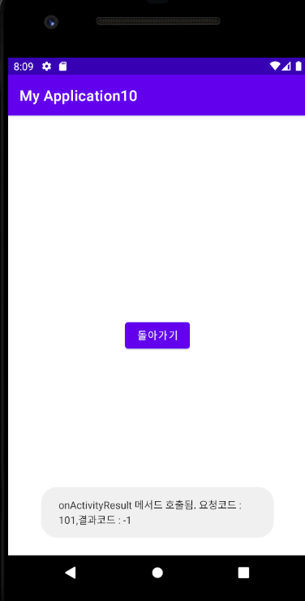</img>

## 11주차 과제 

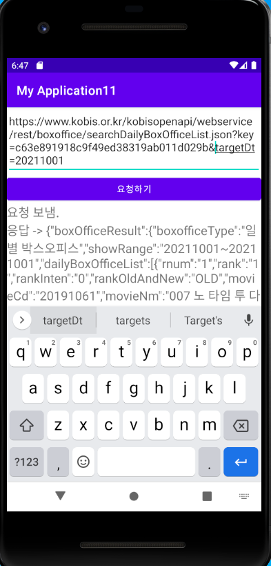</img>

## 12주차 과제

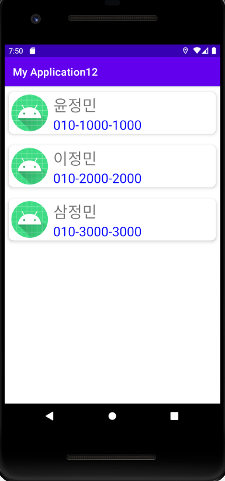</img>

## 13주차 과제 

